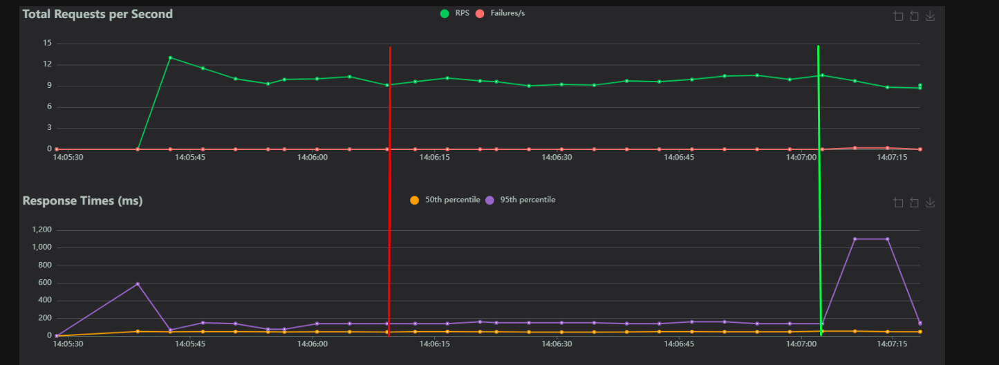

# Добавление нового поля в приложение на Django в таблицу с миллионом записей

Для тестирования времени ответа используется [locust](https://locust.io/)

В таблицу dummies было загружено 1М записей с помощью python manage.py fake_dummies

---

## Способ 1: С помощью миграций Django и вставкой батчами

На первом этапе добавляем новое поле в модель без дефолтного значения и без изменения существующих данных. Это позволяет избежать долгих блокировок, поскольку обновляется только структура таблицы, а данные не изменяются. В Django удобнее всего это сделать через миграции.

### Пример поля:
```python
class MyModel(models.Model):
    new_field_test = models.CharField(max_length=100, blank=True, null=True)
```
Делаем миграцию. Как видно из графика ниже, при 1 миллионе записей и RPS ~13, задержка при добавлении поля отсутствует. Задержка была только при перезапуске приложения.



Теперь добавим дефолтное значение для поля, чтобы новые записи появлялись с значением '1':
```python
class MyModel(models.Model):
    new_field_test = models.CharField(max_length=100, blank=True, null=True, default='1')
```

Снова выполняем миграцию. Как видно из скрина ниже, в момент миграции скорость ответа сервера не изменилась, задержка возникла только при перезапуске приложения.


Теперь обновим значения поля new_field_test в таблице. Мы будем изменять по 1 тысяче строк за раз, чтобы избежать длительных блокировок таблицы. Также будем изменять только те записи, которые в момент запроса не используются другими процессами.

Пример скрипта для обновления строк:
```python
import psycopg2
from psycopg2 import sql
import time

db_config = {
    'dbname': 'test',
    'user': 'postgres',
    'password': 'toor',
    'host': 'localhost',
    'port': '5432'
}

batch_size = 1000

def update_rows():
    updated_rows_total = 0
    try:
        conn = psycopg2.connect(**db_config)
        cursor = conn.cursor()
        while True:
            update_query = sql.SQL("""
                UPDATE dummies 
                SET new_field_test = '1' 
                WHERE id IN (SELECT id FROM dummies WHERE new_field_test IS NULL LIMIT %s FOR UPDATE SKIP LOCKED)
            """)
            cursor.execute(update_query, (batch_size,))
            updated_rows = cursor.rowcount

            conn.commit()
            updated_rows_total += updated_rows
            print(f"Обновлено строк: {updated_rows_total}")

            if updated_rows < batch_size:
                break

    except Exception as e:
        print(e)
    finally:
        if conn:
            cursor.close()
            conn.close()
        print('End')


if __name__ == '__main__':
    time_start = time.time()
    update_rows()
    time_end = time.time()
    print(time_end-time_start)
```
Этот скрипт обработал 1,016,273 строки за 14 секунд. Как видно из скрина ниже, время ответа сервера не изменилось во время выполнения скрипта.


## Способ 2: Postgresql > 11 Версии
Источник: [PostgreSQL Documentation](https://www.postgresql.org/docs/current/ddl-alter.html)

Начиная с версии PostgreSQL 11, добавление столбца с постоянным значением по умолчанию больше не требует обновления каждой строки таблицы. Вместо этого значение по умолчанию будет применяться при следующем обращении к строке, что делает выполнение операции ALTER TABLE значительно более быстрым, даже для больших таблиц.

### Добавление поля с дефолтным значением через ALTER TABLE
```sql
ALTER TABLE dummies ADD COLUMN new_field_test VARCHAR(255) DEFAULT '1';
```

Как видно из скрина ниже, операция добавления колонки была выполнена за 29 миллисекунд, и время отклика не изменилось.


После добавления столбца в таблицу, добавляем поле в модель dummies, создаём миграцию и выполняем её с параметром --fake:
```python
new_field_test = models.CharField(max_length=100, blank=True, null=True, default='1')
```
Выполнение миграции:
```shell
python manage.py migrate --fake
```

## Пример изменения времени ответа с локом таблицы

